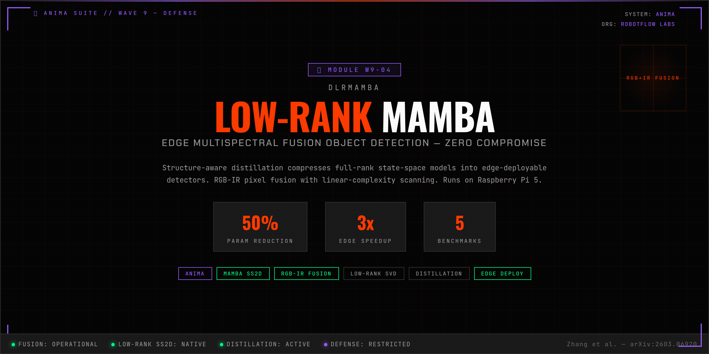

<p align="center">
  
</p>

# DLRMamba (ANIMA Module)

> **DLRMamba: Distilling Low-Rank Mamba for Edge Multispectral Fusion Object Detection**
> Zhang et al. — arXiv:2603.06920

Low-rank SS2D compression with structure-aware distillation for RGB-IR multispectral object detection on edge devices. Pixel-level fusion, linear-complexity scanning, runs on Raspberry Pi 5.

## Quick Start
```bash
# Smoke test
python -m pytest -q

# Debug training (synthetic data)
python -m anima_dlrmamba.train --config configs/debug.toml --max-steps 5

# Full training (LLVIP dataset)
CUDA_VISIBLE_DEVICES=0 python -m anima_dlrmamba.train --config configs/paper.toml

# Inference
python -m anima_dlrmamba.infer --config configs/default.toml --rgb img_rgb.jpg --ir img_ir.jpg

# Export pipeline
python -m anima_dlrmamba.export --config configs/paper.toml --checkpoint best.pth

# Serve
uvicorn anima_dlrmamba.serve:app --host 0.0.0.0 --port 8036
```

## Architecture
- **Pixel-level Fusion**: RGB + IR concatenation → conv projection
- **Low-Rank SS2D**: Block-scan with 64-step recurrence + conv1d cross-block mixing
- **Structure-Aware Distillation**: SVD alignment + state alignment + feature reconstruction
- **Decoupled Head**: Multi-scale P3/P4/P5 with parallel cls + box branches
